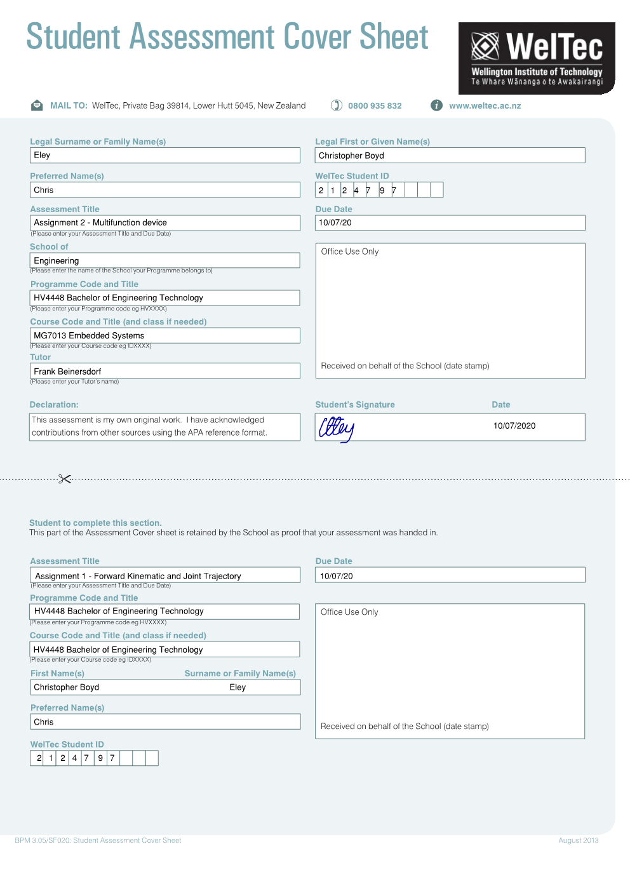
# Oscilloscope + Logic Analyser + Function Generator
**Chris Eley**

**ID#2124797**

**Embedded systems**

**Video Report Link**
Link will be here once video is made

## Requirements

The aim of this project is to create an embedded systems-based device that can provide a number of functions, namely a oscilloscope; a function generator and a logic analyser, using a Teensy 3.2, a 128x64 OLED display and other selected components. The device must include a start screen, a menu screen and a screen for each of the modes. The program must be designed and implemented as a finite state machine. The Adafruit_SDD1306 and Adafruit_GFX libraries should be used to control the display.

## Design

### Schematic

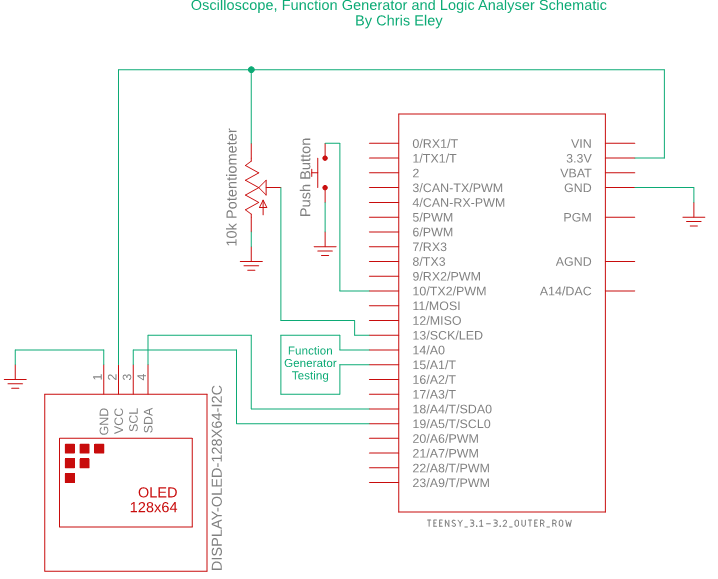
Figure 2. Schematic of component configuration

### Components
This project used the following components
 * Teensy 3.2
   * Arduino framework
   * Programmed using Visual Studio Code

   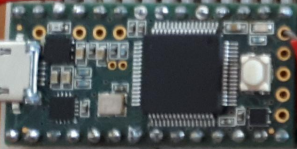
 * SDD1306 128x64 OLED
   * 128x64 Pixels monochrome display
   * I2C protocol
   * Internal Pullup resistors (4.7kohm read from resistor on back)

    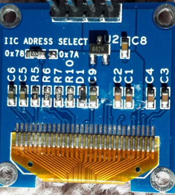
 * 10k$\Omega$  Potentiometer
   * Menu item navigation
   * Oscilloscope testing

   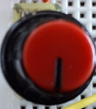
 * Push Button
   * Menu item selection
   * Debounced in code using millis()

   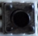

### Libraries
This project used the following libraries
 * Adafruit_SSD1306
   * Controls the display
   * Limited graphical functionality
 * Adafruit_GFX
   * More advanced graphical functionality
   * Shapes and lines etc.
 * Wire
   * Facilatates I2C communication

### State transition diagram

Below is the state transition diagram for the device. It has 8 states, a start screen, a menu screen, one for each of the 3 functions and one for the 3 wave types that can be generated. There are multiple events of 2 types.
 * Button push
 * Serial input- multiple inputs available

All state transitions can be made by either of the events

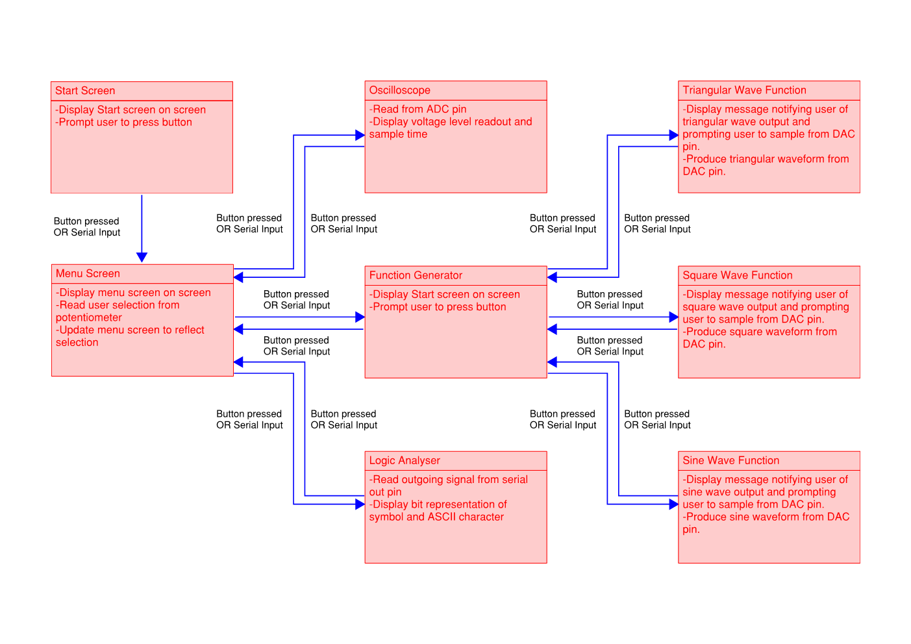

## Implementation
### Wiring
The final wiring can be seen in the figure below.

### Program
#### Includes and setup
In this part of the program the libraries are included, pins are defined, pins are configured, a bit array of a sinewave image is initialised, function prototypes are created, interrupt function is attached and the enum function is used to create the various states that will be used.

#### void loop
In the void loop the various states and the navigation between them are implemented according to the State Transition Diagram.

#### Start Screen
This state is a "welcome" to the device, It has a title area and a prompt to the user to press the button to advance.

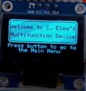

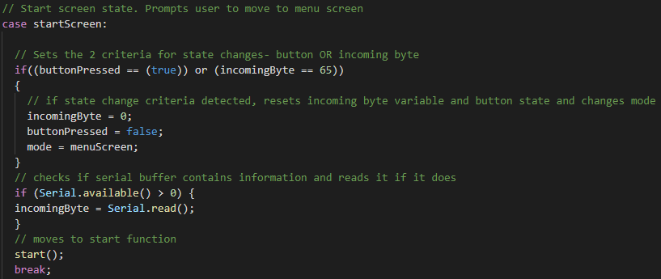

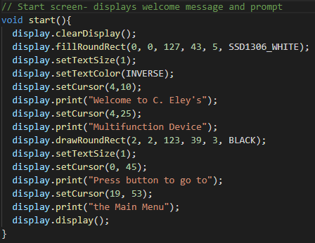

#### Menu Screen
The menu screen has a title at the top and a list of the 3 available functions. A "cursor" (filled circle) moves up and down with the action of the potentiometer to indicate the users current selection and the button or serial input moves the user to either the desired function or the next menu.

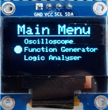

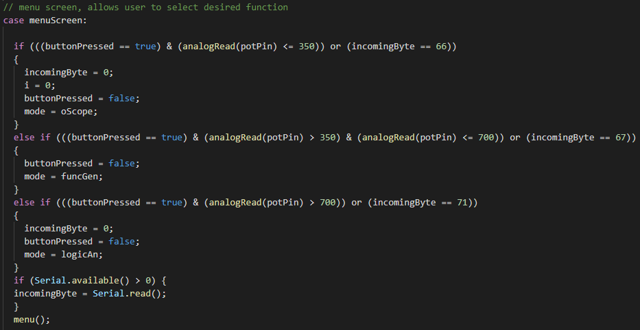

#### Oscilloscope
The oscilloscope function reads the potentiometer (or other vriable voltage source) and outputs a continuous line across the screen at the appropriate height to represent the voltage. Text also displays at the top of the screen of the millivolts and sample time. The button or serial input returns the user to the menu screen. The signal is also output via serial communication to a computer based serial plotter.

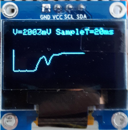

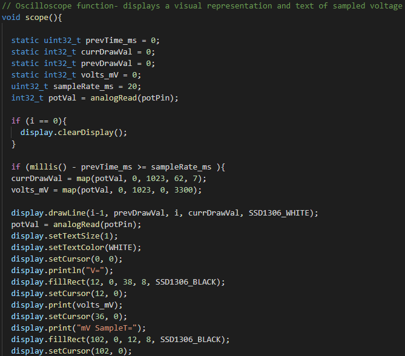

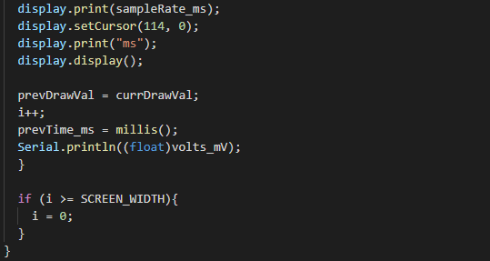

#### Function Generator Menu
This is a further menu that allows the user to select which signal they want to generate. The user current selection in this menu is highlighted by inverting the colour in a rectangle surrounding the selection.

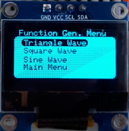

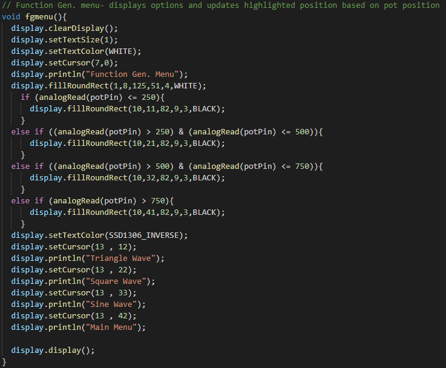

#### Waveform
The 3 waveforms(triangular, square and sine) all have a similar display, and a representative image of the signal that is being produced. For the purposes of testing there is also functionality to sample the DAC pin and see the output on Serial Plot.

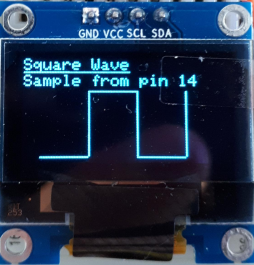

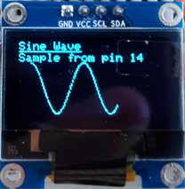

#### Logic Analyser
Unfortunately I did not have sufficient time to complete this function, however a menu item exists which leads the user to a placeholder screen.

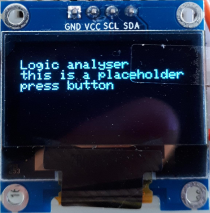

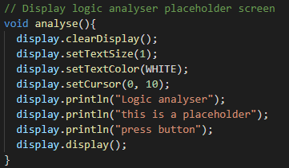

#### Interrupt Service Routine
An interrupt service routine is used to debounce the button and allow the button to be pushed at any time.

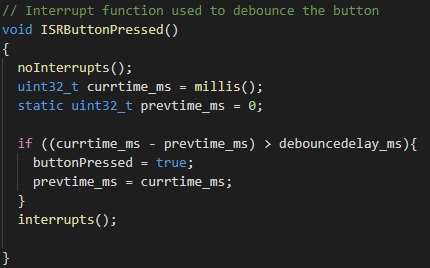

### Difficulties

Some difficulties encountered with this project were
 * for loops
   * Initial attempts to use for loops resulted in difficulties exiting functions and returning to menus. To fix this all for loops were removed and the oscilloscope and waveform codes were redesigned.
 * Counter resetting
   * The variable "i" was used in several functions as a general purpose counter. It was found that it was holding its value when moving from one function to the next, so upon entering each state i was reset back to zero.

## Improvements

There are several improvements the could be made to this project I will briefly list them here.
 * Logic analyser functionality
 * Ability to alter frequency of wave forms
   * The potentiometer could be used to alter the frequency of the output signals in Function Generator mode.
 * Adjust sample rate of oscilloscope 
   * Using the potentiometer to adjust the scopo sample rate.
 * Scrolling Oscilloscope image
   * Develop a scrolling image for the oscilloscope to replace the line that moves from left to right and then refreshes when it hits the right hand edge. 

## Conclusion

The aim of this project is to create an embedded systems-based device that can provide a number of functions, namely a oscilloscope; a function generator and a logic analyser, using a Teensy 3.2, a 128x64 OLED display and other selected components. The device must include a start screen, a menu screen and a screen for each of the modes. The program must be designed and implemented as a finite state machine.
While there are several improvements that could be made, the program as it is succeeded in all of the stated aims. I have certainly learnt a lot about he use and implementation of function state machines.