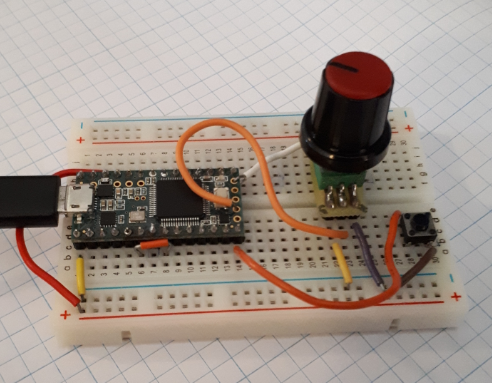
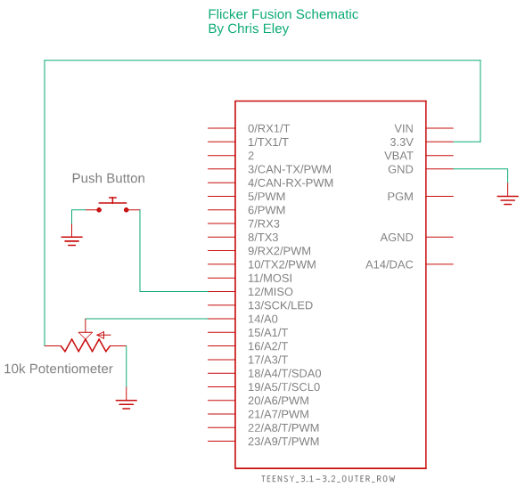
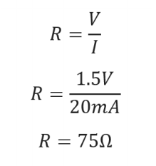
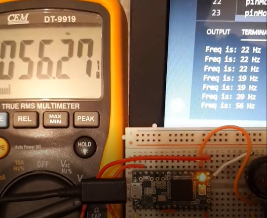

# :sparkle: Ass. 0- Flicker fusion :sparkle:

::
### By Chris Eley

## 0. Video Link

[Flicker Fusion Video](https://youtu.be/r8V6gB2CDY4)

## 1. Abstract

The purpose of this project is to build a device that can be used to measure an individual&#39;s &quot;Flicker Fusion Threshold&quot;, this is the frequency when a steadily flickering light appears to become steady for the observer.

## 2. Introduction

Using a Teensy 3.2 Microcontroller I have designed and built a prototype of a Flicker Fusion Threshold measuring device. It uses a potentiometer to allow the user to adjust the rate of flickering of the built in LED, once the user can no longer observe flickering, they press a button and a serial terminal will display the current frequency.

## 3. Methods

To achieve the desired result the potentiometer is connected to an analogue pin which provides a 12 Bit input (0-1023 in decimal) which is either multplied by 10 (if the analogue read is in the lower quarter of possible values, or if higher than this to be multiplied by 30 to give the half period length (in microseconds). The purpose of the two different values is to stop the frequency from suddenly getting much higher for lower values read from the potentiometer. 

Once the elapsed time reaches the half period length the LED changes state. This gives a 50% on/off cycle for the LED with a variable frequency.

The frequency is calculated by dividing 1000000 by the Period (in microseconds).

When the push button is depressed and released the program enters the interrupt Service Routine (ISR) and performs a debounce check of the button before printing the frequency value on a serial terminal on a connected device.

This project uses the built-in LED, however if a seperate LED was used a current limiting resistor would be required. To calculate this we need the system voltage (VCC), LED forward voltage, LED forward current. These can be obtained from relevant datasheets. Here is an example.
[LED datasheet](Documentation/Datasheets/element14_1003210_LED.pdf)

And then we must round up to the next standard resistor size, in this case 82 ohms.

## 4. Results

The resulting device successfully completes its task and the frequency readout is accurate over the range of expected values (16 – 200 Hz).

## 5. Discussion

Due to the relationship between frequency and period when the analogue value read by the Teensy is very low there will be large jumps in frequency, to counter this it is important to select the correct multiplier for the analogue value. I found that 10 and 30 give a good balance between still providing a usable low end frequency value (16Hz) and giving good accuracy at the top end. For example if 1 is used as the multiplier the minimum frequency obtainable is 489 Hz, well above the Flicker Fusion Threshold of most humans, and if 50 is used then the usable band only just extends past the range of expected values (by my extensive survey of 7 household members with ages ranging from 6-70 the flicker fusion threshold was from 25-60Hz) before the frequency values start rising too quickly to be accurate.

## 6. Conclusions

In conclusion the device works correctly and for the broad range of humans provides an accurate and reliable indication of their flicker fusion threshold.

## 7. References

Avago Technologies. (2014, march 25). _Datasheets._ Retrieved from www.avagotech.com: https://www.mouser.com/datasheet/2/678/AV02-1562EN\_DS\_HLMP-x15x\_2018-07-23-1827993.pdf